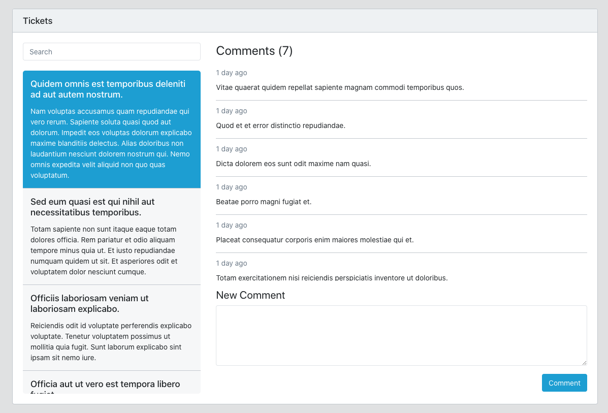

# Livewire Demo by Mitul Golakiya

This is a demo of [Laravel](https://laravel.com/) [Livewire](https://laravel-livewire.com/) for the session taken by [Mitul Golakiya](https://github.com/mitulgolakiya) during [Laravel Live India](https://twitter.com/LaraconIN) April 2020 Online Meetup.

We built a kind of Support ticket system where you can list the ticket, click the ticket on left side, and it will load all the comments of that ticket in the right sidebar without writing any single piece of Javascript code.

Also, you can search tickets and add new comments to the ticket without leaving a page just like and SPA (Single Page Application).

Here is the screenshot of demo application.

Here is the flow/stuff that was covered during demo. 

1. Basic Project Setup
    - Laravel Application
    - Setup .env
    - Install basic packages
    - Install Livewire
  
2. Setup Tickets and Comments
    - Create Migrations
    - Create Models
    - Create TicketController
    - Create Seeders for some initial demo data
    - Setup Layout
    - Setup Tickets List View
    - Setup Comments View
    
3. Setup Livewire Setup CSS + Script
    
4. Understand Component Structure
    - Create First Component - TicketsWindow
    - Component File + View File

5. Reactor TicketsWindow Component
    - Move Blade Code to component file
    - Use component in our blade view
    - Pass Data by Component
    
5. Create TicketsList Component
    - Move blade code to component file
    - Pass Data to view

6. Create CommentsList Component
    - Move blade code to component file
    - Pass Data to view

7. Data Binding
    - Public properties + mount method
    - Reactor components to use public properties
    
8. Livewire Actions
    - Add Interactions to Tickets List
    - Handle Ticket Click
    - Make Ticket selected
    
9. Livewire Events
    - Render Comments of selected ticket
    - Dispatch Event from Tickets List when ticket selected
    - Listen event in CommentsList component
    - Refresh the comments of selected ticket
    
10. Add Comment
    - Add new comment without page refresh
    
11. Handle No Ticket Selection
    - If not ticket has been selected then display empty state
    
12. Implement Search
    - Define as a model
    - Make search working
    - Handle few bugs of selections
    
13. Display Comments Count
